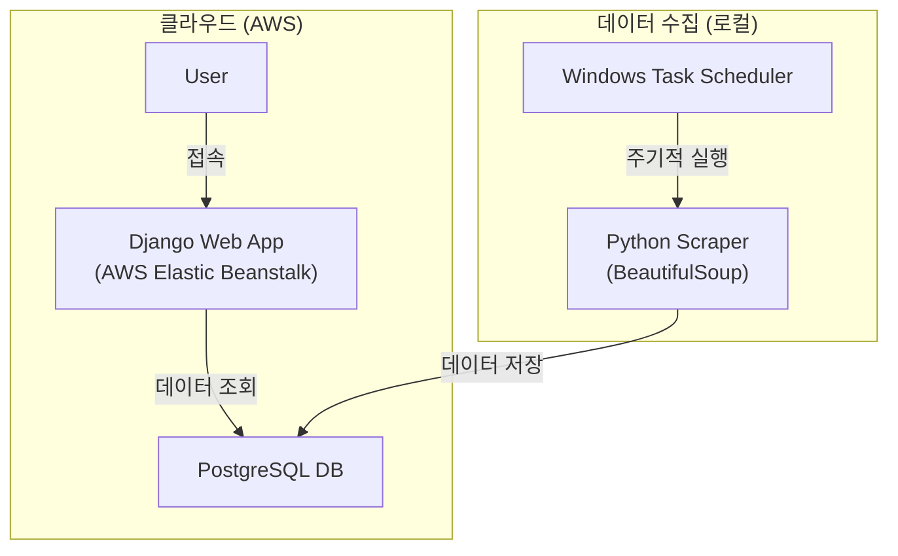

# OkkyDokky: Django 기반 개발자 Q&A 커뮤니티 클론

   

## 1. 프로젝트 개요

국내 개발자 Q&A 사이트인 `Okky.kr`을 사용자 친화적으로 개선하여 클론한 프로젝트입니다. Python과 Django 프레임워크를 처음 학습하며 진행했으며, 20만 개 이상의 게시글 데이터를 직접 스크래핑하여 DB를 구축하고, 이를 기반으로 웹 서비스를 개발 및 배포한 전 과정을 경험했습니다.

> **참고:** 2022년 8월 Okky 사이트의 대규모 개편으로 인해, 이 프로젝트를 위해 작성된 데이터 수집 코드는 현재 동작하지 않습니다. 프로젝트는 개편 전 수집된 데이터를 기반으로 구현되었습니다.

## 2. 주요 기능

- **대규모 데이터 수집:** Python 기반 크롤러를 제작하여 Okky Q&A 게시판의 게시글 20만여 개를 수집 및 가공 후 데이터베이스에 저장했습니다.
- **정보 필터링 및 우선순위 정렬:** 댓글 유무, 채택 답변 유무에 따라 게시글을 선별하고, 채택된 글을 우선 노출하여 정보 탐색 효율을 높였습니다.
- **비동기 UI/UX:** jQuery를 활용하여 페이지 전환 없이 답변을 보거나 숨길 수 있는 비동기 게시판을 구현했습니다.
- **콘텐츠 자동 태깅:**
  - 게시글 본문의 코드 블록을 분석하여 사용된 프로그래밍 언어(C, Python, Java 등)를 자동으로 태그하여 표시합니다.
  - 본문에 이미지나 코드가 포함되었는지 여부를 아이콘으로 미리 보여줍니다.
- **통합 검색:** AND 또는 OR 조건을 사용자가 직접 선택하여 검색할 수 있는 기능을 제공합니다.
- **데이터 시각화:** Toast UI Chart를 이용해 수집된 데이터에 대한 통계를 보여주는 대시보드를 구현했습니다.

## 3. 기술 아키텍처 및 구현

Django 웹 애플리케이션을 AWS Elastic Beanstalk에 배포하고, 별도의 스크립트로 데이터 수집을 자동화하는 구조입니다.

- **애플리케이션 서버:** **Django(v3.0.14)** 프레임워크로 개발되었으며, **AWS Elastic Beanstalk**를 통해 배포되어 외부 사용자의 요청을 처리합니다.
- **데이터베이스:** 수집된 모든 데이터는 AWS의 관리형 데이터베이스 서비스에 저장됩니다.
- **데이터 수집:** **BeautifulSoup** 라이브러리를 사용한 Python 스크립트가 `Okky.kr` 사이트를 스크래핑합니다. 이 스크립트는 **Windows 작업 스케줄러**에 등록되어 주기적으로 실행되며, 새로운 게시글이나 변경 사항을 DB에 업데이트합니다.
- **프론트엔드:** **HTML**과 **JavaScript(jQuery)**를 사용하여 동적인 사용자 인터페이스를 구현했습니다.

## 4. 문제 해결 및 기술 의사결정 과정

- **문제 1: 데이터 수집 중단 현상**
  - **현상:** 패턴 없이 간헐적으로 크롤링이 중단되었습니다.
  - **분석:** 오류가 발생한 URL을 별도로 저장 후 재시도했으나 동일한 문제가 발생했습니다. 해당 URL을 직접 접속해보니, Okky 서버 자체의 오류로 게시글이 표시되지 않는 것을 확인했습니다.
  - **해결:** 게시글 제목이 없는 경우 발생하는 오류로 결론짓고, 예외 처리를 통해 해당 URL을 건너뛰도록 하여 전체 수집 프로세스가 중단되지 않도록 조치했습니다.

- **문제 2: 데이터 로딩 속도 저하**
  - **현상:** 페이지네이션 처리 시 전체 페이지 수를 계산하는 과정에서 심각한 속도 저하가 발생했습니다.
  - **분석:** 코드 실행 시간을 구간별로 측정한 결과, 전체 게시글 목록의 길이를 `len()` 함수로 계산하는 부분에서 병목이 발생함을 확인했습니다.
  - **해결:** Django ORM의 `len(queryset)` 대신, 데이터베이스 수준에서 효율적으로 개수를 세는 `queryset.count()` 메소드로 변경하여 쿼리 성능을 최적화하고 로딩 속도를 개선했습니다.

## 5. 배포 및 운영

- **배포:** AWS Elastic Beanstalk 서비스를 이용하여 애플리케이션을 배포하고, 가비아에서 구매한 도메인을 AWS Route 53에 연결하여 서비스했습니다.
- **운영 및 관리:** Windows 작업 스케줄러를 통해 데이터 수집 스크립트를 주 단위로 자동 실행하여 아래와 같은 내용을 업데이트했습니다.
  - 신규 게시글 수집
  - 답변이 추가되거나 채택된 게시글 정보 업데이트

## 6. 향후 개선 방향

- **데이터 수집기 v2.0 개발:** 개편된 Okky 사이트(v2.0) 구조에 맞춰 데이터 수집 코드를 재작성하고 프로젝트를 최신화할 필요가 있습니다.

## 7. 실행 결과 (Screenshots)

*메인 페이지*

*게시판 페이지*

*마이 페이지 (대시보드)*

*검색, N개씩 보기, 태그 정렬 기능*